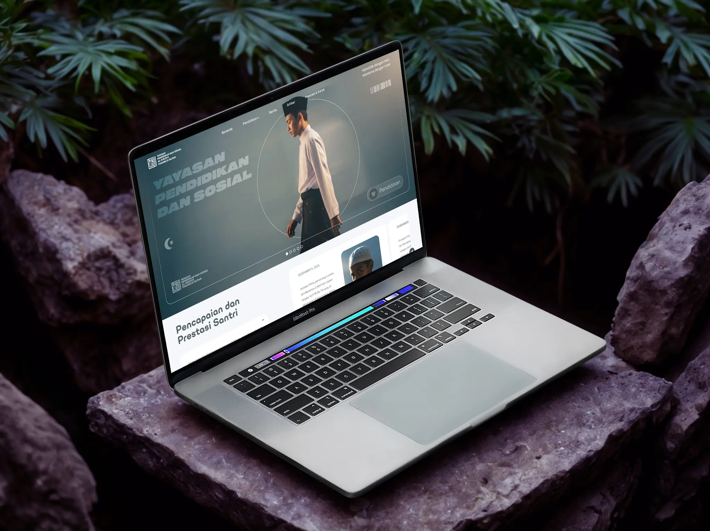
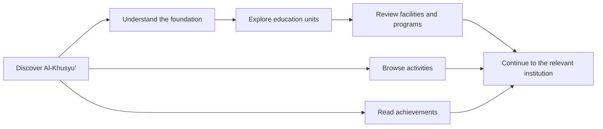
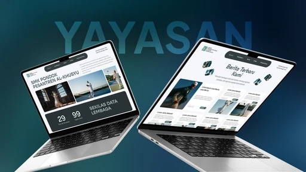

  

<h1 align="center">AlKhusyu</h1>

  A considered digital platform for Yayasan Pendidikan dan Sosial Al-Khusyu',
  connecting institutional identity, education units, programs, activities,
  achievements, and community information.

  <a href="https://alkhusyu.com"><strong>Live Website</strong></a>
  &nbsp;&middot;&nbsp;
  <a href="#experience-model">Experience Model</a>
  &nbsp;&middot;&nbsp;
  <a href="#local-development">Local Development</a>

  
  
  
  
  

> [!NOTE]
> This repository contains the public frontend for the Al-Khusyu' institutional
> website. Content, imagery, and deployment configuration should be reviewed by
> the foundation before a production release.

## Overview

AlKhusyu is the public digital presence of Yayasan Pendidikan dan Sosial
Al-Khusyu' in Blitar, Indonesia. It brings the foundation's identity and its
education ecosystem into one coherent interface for prospective families,
students, staff, alumni, and the wider community.

The experience is designed around discovery rather than administration.
Visitors can understand the foundation, compare education units, explore
programs and activities, review achievements, and continue into detailed
content without leaving the institutional context.

## Platform At A Glance

| Area | Public experience |
| --- | --- |
| Foundation | Institutional profile, history, mission, and organizational context |
| Education | Dedicated journeys for Madrasah, TK, SMP, SMK, Tahfidz, Pesantren, Diniyah, TPQ, BQ, Sanggar, and LKSA |
| Programs | Discoverable program catalogue with focused detail pages |
| Activities | Current activity collection with reusable editorial entries |
| Achievements | Achievement overview and individual stories |
| Discovery | Search-friendly metadata, sitemap coverage, and responsive navigation |

## Experience Model

The route model keeps foundation-level context available while visitors move
into a specific institution or content collection. Reusable page sections give
each unit a consistent structure without forcing every unit to tell the same
story.

## Selected Experiences

<table>
  <tr>
    <td width="50%">
      
    </td>
    <td width="50%">
      
    </td>
  </tr>
  <tr>
    <td align="center"><strong>Education and program discovery</strong></td>
    <td align="center"><strong>Foundation stories and community context</strong></td>
  </tr>
</table>

The visual system balances institutional clarity with a contemporary editorial
presentation. Large media, deliberate typography, and structured content blocks
help each education unit retain its own identity inside one foundation website.
