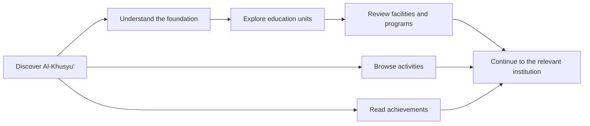
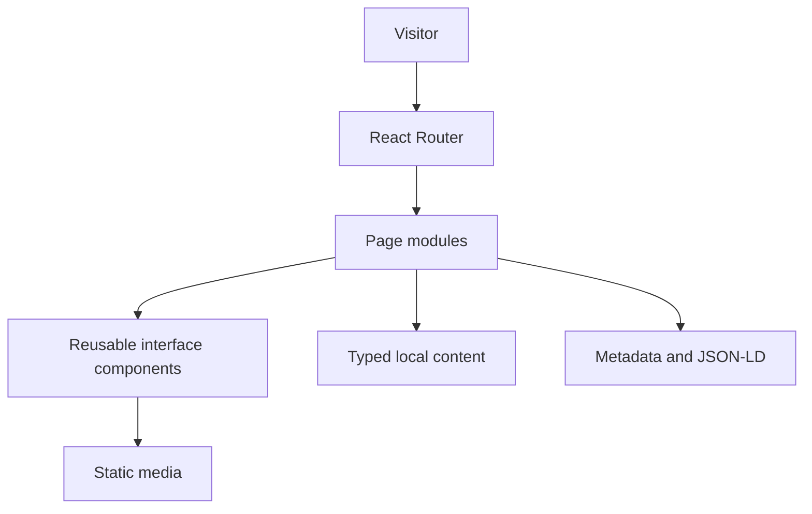

<p align="center">
  
</p>

<h1 align="center">AlKhusyu</h1>

<p align="center">
  A considered digital platform for Yayasan Pendidikan dan Sosial Al-Khusyu',
  connecting institutional identity, education units, programs, activities,
  achievements, and community information.
</p>

<p align="center">
  <a href="https://alkhusyu.com"><strong>Live Website</strong></a>
  &nbsp;&middot;&nbsp;
  <a href="#experience-model">Experience Model</a>
  &nbsp;&middot;&nbsp;
  <a href="#local-development">Local Development</a>
</p>

<p align="center">
  
  
  
  
  
</p>

> [!NOTE]
> This repository contains the public frontend for the Al-Khusyu' institutional
> website. Content, imagery, and deployment configuration should be reviewed by
> the foundation before a production release.

## Overview

AlKhusyu is the public digital presence of Yayasan Pendidikan dan Sosial
Al-Khusyu' in Blitar, Indonesia. It brings the foundation's identity and its
education ecosystem into one coherent interface for prospective families,
students, staff, alumni, and the wider community.

The experience is designed around discovery rather than administration.
Visitors can understand the foundation, compare education units, explore
programs and activities, review achievements, and continue into detailed
content without leaving the institutional context.

## Platform At A Glance

| Area | Public experience |
| --- | --- |
| Foundation | Institutional profile, history, mission, and organizational context |
| Education | Dedicated journeys for Madrasah, TK, SMP, SMK, Tahfidz, Pesantren, Diniyah, TPQ, BQ, Sanggar, and LKSA |
| Programs | Discoverable program catalogue with focused detail pages |
| Activities | Current activity collection with reusable editorial entries |
| Achievements | Achievement overview and individual stories |
| Discovery | Search-friendly metadata, sitemap coverage, and responsive navigation |

## Experience Model



The route model keeps foundation-level context available while visitors move
into a specific institution or content collection. Reusable page sections give
each unit a consistent structure without forcing every unit to tell the same
story.

## Selected Experiences

<table>
  <tr>
    <td width="50%">
      
    </td>
    <td width="50%">
      
    </td>
  </tr>
  <tr>
    <td align="center"><strong>Education and program discovery</strong></td>
    <td align="center"><strong>Foundation stories and community context</strong></td>
  </tr>
</table>

The visual system balances institutional clarity with a contemporary editorial
presentation. Large media, deliberate typography, and structured content blocks
help each education unit retain its own identity inside one foundation website.

## Navigation Model

| Route | Purpose |
| --- | --- |
| `/` | Foundation overview, education entry points, mission, programs, news, and achievements |
| `/tentang` | Foundation history and mission |
| `/kegiatan` | Activity collection and `/kegiatan/:slug` detail pages |
| `/program` | Program collection and `/program/:slug` detail pages |
| `/prestasi` | Achievement collection and `/prestasi/:slug` entries |
| `/pendidikan/:unit` | Focused education-unit experiences |

The current education routes cover `madrasah`, `tk`, `smp`, `smk`, `tahfidz`,
`pesantren`, `diniyah`, `tpq`, `bq`, `sanggar`, and `lksa`.

## Architecture

AlKhusyu is a client-rendered React application built as a typed, component-led
frontend. React Router owns public navigation, page modules compose each
institutional journey, and local TypeScript data modules provide reusable
program, activity, and achievement content.



## Technology Profile

| Layer | Technology | Responsibility |
| --- | --- | --- |
| Application | React 19, TypeScript 5 | Typed page and component composition |
| Navigation | React Router 7 | Foundation, collection, detail, and education-unit routes |
| Styling | Tailwind CSS 4 | Responsive layout and design tokens |
| Components | Radix Slot, class-variance-authority | Reusable component behavior and variants |
| Interaction | Embla Carousel, Lucide React | Media collections and interface iconography |
| Build | Vite 7 | Local development and optimized production bundles |
| Quality | ESLint, TypeScript | Static analysis and type validation |
| Discovery | Metadata, JSON-LD, sitemap, robots.txt | Search and social presentation |

## Engineering Highlights

- Route-level page modules keep institutional journeys explicit and reviewable.
- Typed content collections separate editorial records from presentation logic.
- Shared education components give facilities, missions, organizations,
  activities, and achievements a consistent structure across units.
- Responsive navigation supports wide and compact viewports from one route map.
- Lazy media loading and reusable optimized-image behavior reduce avoidable
  page weight while preserving descriptive alternative text.
- Per-page metadata and organization JSON-LD provide a foundation for search and
  social discovery.
- SPA fallback configuration preserves deep links when deployed to Vercel.

## Search And Discovery

The application maintains document titles, descriptions, keywords, canonical
URLs, Open Graph fields, Twitter Card fields, and educational-organization
JSON-LD through the shared `SEO` component. Static crawler entry points live in
`public/robots.txt` and `public/sitemap.xml`.

Search metadata is part of the content contract. When a public route or domain
changes, update its page metadata, canonical URL, sitemap entry, and crawler
policy together so discovery signals do not diverge from the rendered site.

## Local Development

### Prerequisites

- Node.js 20 or newer
- npm 10 or newer

### Setup

```bash
git clone https://github.com/ibamzjr/AlKhusyu.git
cd AlKhusyu
npm ci
npm run dev
```

Vite prints the local development URL after startup. The development server
supports client-side navigation; the production host must provide the same SPA
fallback for deep links.

### Quality Commands

```bash
npm run lint
npm run build
npm run preview
```

`npm run lint` checks the TypeScript and React source. `npm run build` performs
the TypeScript project build before Vite produces the deployable `dist`
directory. `npm run preview` serves that production output for a final local
review.

## Deployment

The repository includes `vercel.json` with a catch-all rewrite to `index.html`,
allowing direct access to nested React Router URLs. A deployment should use:

| Setting | Value |
| --- | --- |
| Install command | `npm ci` |
| Build command | `npm run build` |
| Output directory | `dist` |

Before promoting a release, validate the canonical production domain, every
public route, metadata previews, sitemap URLs, media licensing, and responsive
behavior against the deployed build.

## Content Maintenance

Editorial collections live under `src/data`, while education-unit narratives
are composed in `src/pages/Education`. Static media belongs in `public/image`
and repository presentation media belongs in `assets`.

When publishing content:

1. Confirm names, dates, locations, and institutional terminology with the
   responsible education unit.
2. Provide meaningful alternative text and appropriately sized media.
3. Keep collection slugs stable after publication.
4. Review the corresponding detail route on mobile and desktop.
5. Re-run lint and the production build before deployment.
